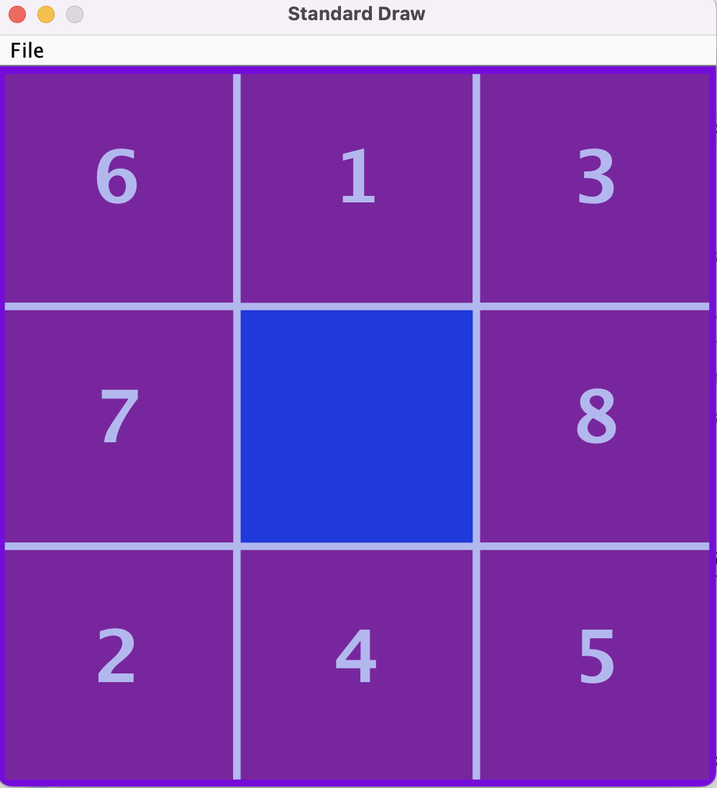

# 8-Puzzle-Game
 
 I implement a Java-based project into my base code for my Programming Studio Lesson’s Project
My Java-based project aims to solve the 8-puzzle game to reach the goal state with as few moves
as possible. This project involves the implementation of a widely used algorithm which is A* to find
the solution. I used Manhattan distance and Misplaced Tiles heuristics to guide the search process.
And I used the StdDraw library for graphical visualization.
My purpose of this project is the find two possible solutions with Manhattan Distance and
Misplaced Tiles heuristic which used in A* algorithm to guide the search process and show the
solutions of the 8-puzzle game

This project involves the implementation of a widely used algorithm which is A* to find the
solution. I used Manhattan distance and Misplaced Tiles heuristics to guide the search process. And I
used the StdDraw library for graphical visualization. Here are the classes I used in my code:
**1. Board.java**
   The Board class forms the backbone of an 8 puzzle game, managing the arrangement of tiles on the grid and facilitating player interactions. It defines essential properties like colors and line thickness for visual rendering and offers methods for setting and retrieving the board's state. Movement methods control the empty cell's motion, enforcing game rules, while the draw() method visually renders the board using the StdDraw library. Overall, the Board class ensures a cohesive and engaging gaming experience by organizing the puzzle grid and enabling player interactions.

**2. Tile.java**
   The Tile class encapsulates the essential properties and behavior of individual square tiles within an 8 puzzle game. Each tile is represented by a Tile object, initialized with a specific number. The class provides methods to draw these tiles on the game board, utilizing specified colors and fonts for aesthetic presentation. Through the draw() method, each tile is visually rendered with its assigned number centered within, enclosed by a bounding box for clarity. With its data fields and methods, the Tile class serves as a fundamental building block for modeling and managing the tile-based aspects of the puzzle game, facilitating both its visual representation and logical manipulation.
   
**3. EightPuzzle.java**
   The EightPuzzle class serves as a representation of the puzzle state within the 8 puzzle problem. It encapsulates crucial attributes such as the puzzle board configuration, the cost incurred from the start state (denoted as "g"), the heuristic value (denoted as "h"), the total cost (denoted as "f"), and the sequence of moves made to reach the current state. This class offers getter methods to access the puzzle board, total cost, and moves, facilitating access to these essential properties for further analysis or manipulation.
In essence, the EightPuzzle class acts as a container for all pertinent information related to a specific state of the puzzle. By encapsulating these attributes and providing access methods, it enables efficient management and retrieval of puzzle state data, contributing to the overall functionality and flexibility of the 8 puzzle-solving process.

**4. EightPuzzleSolver.java**
   The EightPuzzleSolver class is the core of the puzzle-solving logic. It consolidates methods for various puzzle operations, including printing the puzzle grid, generating a random puzzle, checking its solvability, and implementing the A* search algorithm with heuristics. This class encapsulates the essential functionalities required to solve the 8-puzzle problem efficiently.

<figure>
    
    <figcaption>Initial State of The Puzzle</figcaption>
</figure>
<figure>
    
    <figcaption>Final State of The Puzzle</figcaption>
</figure>
<figure>
    
    <figcaption>Solutions of The Puzzle</figcaption>
</figure>

 
